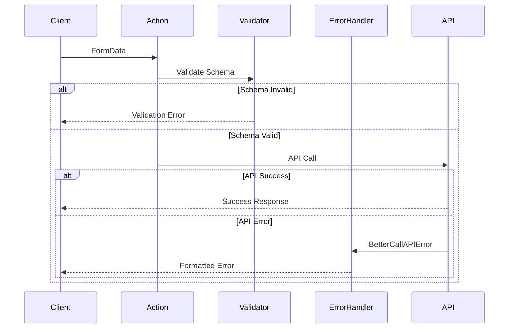

# Design Document

## Overview

Este diseño presenta una refactorización completa del sistema de acciones del servidor para eliminar la duplicación de código y crear un sistema genérico y reutilizable. La solución se basa en tres componentes principales: un tipo ActionState genérico, una función unificada de validación, y un manejador centralizado de errores.

## Architecture

### Current State Analysis

El sistema actual presenta los siguientes problemas:
- **Duplicación de tipos**: 6 tipos diferentes de ActionState que son esencialmente variaciones del mismo patrón
- **Funciones duplicadas**: `validatedAction` y `validatedActionWithUser` con lógica similar
- **Manejo de errores repetitivo**: Cada acción repite la misma lógica de manejo de `BetterCallAPIError`
- **Falta de consistencia**: Diferentes acciones manejan errores de manera ligeramente diferente

### Proposed Architecture

La nueva arquitectura se basa en tres pilares:

1. **Generic Type System**: Un tipo `ActionState<T>` genérico que reemplaza todos los tipos específicos
2. **Unified Validation**: Una función `createValidatedAction` que maneja tanto casos con usuario como sin usuario
3. **Centralized Error Handling**: Una función `handleAPIError` que estandariza el manejo de errores

## Components and Interfaces

### 1. Generic ActionState Type

```typescript
export type ActionState<T = void> = {
  success?: boolean;
  error?: string;
  message?: string;
  data?: T;
  redirect?: boolean;
  url?: string;
};
```

**Características:**
- Genérico con parámetro de tipo `T` para datos específicos
- Incluye todas las propiedades comunes del sistema actual
- Valor por defecto `void` para casos simples
- Compatible con el sistema existente

**Ejemplos de uso:**
```typescript
type SignInActionState = ActionState<{ user: User }>;
type VerifyEmailActionState = ActionState<{ verified: boolean }>;
type SimpleActionState = ActionState; // Equivale a ActionState<void>
```

### 2. Unified Validation Function

```typescript
type ValidatedOptions = {
  withUser?: boolean;
};

export function createValidatedAction<TInput, TOutput>(
  schema: z.ZodType<TInput>,
  action: (data: TInput, user?: User) => Promise<TOutput>,
  options: ValidatedOptions = {}
): (formData: FormData) => Promise<TOutput>
```

**Características:**
- Función genérica que unifica `validatedAction` y `validatedActionWithUser`
- Parámetro `options` para especificar si requiere usuario
- Type-safe con inferencia automática de tipos
- Manejo consistente de validación y errores

**Flujo de ejecución:**
1. Parsea FormData a objeto JavaScript
2. Valida datos contra el esquema Zod
3. Si `withUser: true`, obtiene y valida usuario autenticado
4. Ejecuta la función de acción con datos validados
5. Retorna resultado o error en formato consistente

### 3. Centralized Error Handler

```typescript
export function handleAPIError(
  error: unknown, 
  fallbackMessage = "Error desconocido"
): { success: false; error: string }
```

**Características:**
- Maneja específicamente `BetterCallAPIError`
- Extrae mensaje del cuerpo de la respuesta si está disponible
- Usa mensaje de fallback personalizable
- Formato de retorno consistente

**Lógica de manejo:**
1. Castea error a `BetterCallAPIError`
2. Extrae `error.body?.message` si existe
3. Usa fallback si no hay mensaje específico
4. Retorna objeto con `success: false` y mensaje de error

## Data Models

### Type Relationships

```mermaid
graph TD
    A[ActionState&lt;T&gt;] --> B[SignInActionState]
    A --> C[VerifyEmailActionState]
    A --> D[SimpleActionState]
    
    E[createValidatedAction] --> F[ValidatedOptions]
    E --> G[ZodSchema]
    E --> H[ActionFunction]
    
    I[handleAPIError] --> J[BetterCallAPIError]
    I --> K[ErrorResponse]
    
    B --> L[ActionState&lt;{user: User}&gt;]
    C --> M[ActionState&lt;{verified: boolean}&gt;]
    D --> N[ActionState&lt;void&gt;]
```

### Migration Mapping

| Current Type | New Type |
|-------------|----------|
| `SignInActionState` | `ActionState<{ user: User }>` |
| `SignUpActionState` | `ActionState<{ user: User }>` |
| `VerifyEmailActionState` | `ActionState<{ verified?: boolean }>` |
| `ResetPasswordActionState` | `ActionState` |
| `ForgotPasswordActionState` | `ActionState` |
| `SendVerificationActionState` | `ActionState` |

## Error Handling

### Error Flow Design



### Error Types Handled

1. **Validation Errors**: Errores de esquema Zod
2. **Authentication Errors**: Usuario no autenticado en acciones que requieren usuario
3. **API Errors**: Errores de `BetterCallAPIError` con mensaje específico
4. **Unknown Errors**: Errores no tipificados con mensaje de fallback

### Error Response Format

Todos los errores siguen el mismo formato:
```typescript
{
  success: false,
  error: string // Mensaje descriptivo del error
}
```

## Testing Strategy

### Unit Testing Approach

1. **Type Testing**
   - Verificar inferencia correcta de tipos genéricos
   - Validar compatibilidad con tipos existentes
   - Probar edge cases de tipos

2. **Validation Testing**
   - Casos exitosos con y sin usuario
   - Errores de validación de esquema
   - Errores de autenticación
   - Manejo de FormData malformada

3. **Error Handling Testing**
   - `BetterCallAPIError` con mensaje
   - `BetterCallAPIError` sin mensaje
   - Errores no tipificados
   - Mensajes de fallback personalizados

### Integration Testing

1. **Migration Testing**
   - Verificar que acciones migradas mantienen funcionalidad
   - Probar compatibilidad con componentes existentes
   - Validar que no se rompen flujos existentes

2. **End-to-End Testing**
   - Flujos completos de autenticación
   - Manejo de errores en UI
   - Comportamiento de redirecciones

### Test Structure

```typescript
describe('ActionState Generic Type', () => {
  it('should infer correct types for specific data');
  it('should work with void data type');
  it('should be compatible with existing components');
});

describe('createValidatedAction', () => {
  describe('without user', () => {
    it('should validate and execute action');
    it('should handle validation errors');
  });
  
  describe('with user', () => {
    it('should require authenticated user');
    it('should pass user to action function');
    it('should handle authentication errors');
  });
});

describe('handleAPIError', () => {
  it('should extract message from BetterCallAPIError');
  it('should use fallback for unknown errors');
  it('should return consistent format');
});
```

## Implementation Strategy

### Phase 1: Core Infrastructure
1. Crear tipos genéricos en `lib/validations.ts`
2. Implementar `createValidatedAction`
3. Implementar `handleAPIError`
4. Crear tests unitarios

### Phase 2: Migration
1. Migrar acciones de autenticación una por una
2. Actualizar imports en componentes
3. Verificar funcionalidad con tests de integración
4. Documentar cambios

### Phase 3: Cleanup
1. Remover tipos obsoletos
2. Remover funciones duplicadas
3. Actualizar documentación
4. Optimizar imports

### Backward Compatibility

Durante la migración, se mantendrá compatibilidad:
- Tipos existentes se marcarán como `@deprecated`
- Funciones existentes se mantendrán hasta completar migración
- Alias de tipos para transición suave

## Performance Considerations

### Memory Usage
- Reducción de tipos duplicados
- Menor overhead de TypeScript en compilación
- Reutilización de funciones comunes

### Runtime Performance
- Sin impacto en rendimiento de ejecución
- Misma lógica de validación
- Optimización de manejo de errores

### Bundle Size
- Reducción de código duplicado
- Mejor tree-shaking
- Funciones más pequeñas y enfocadas

## Security Considerations

### Authentication
- Validación consistente de usuario autenticado
- Manejo seguro de tokens y sesiones
- Prevención de bypass de autenticación

### Data Validation
- Validación estricta con Zod
- Sanitización de FormData
- Prevención de inyección de datos

### Error Information
- No exposición de información sensible en errores
- Mensajes de error consistentes
- Logging seguro de errores del servidor