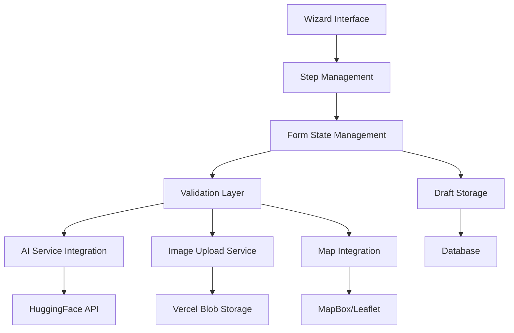

# Design Document

## Overview

The AI Property Wizard is a modern, multi-step property listing creation system that leverages artificial intelligence to enhance the user experience. The system transforms the traditional property form into an intuitive wizard interface with four distinct steps, each optimized for specific data collection tasks. The design emphasizes progressive disclosure, real-time validation, and seamless integration with external services for AI content generation and cloud storage.

## Architecture

### High-Level Architecture



### Component Architecture

The wizard follows a container-presenter pattern with centralized state management:

- **WizardContainer**: Main orchestrator managing step navigation and global state
- **StepComponents**: Individual step implementations with local validation
- **SharedServices**: AI, upload, and mapping services
- **ValidationLayer**: Zod schemas for both client and server validation

## Components and Interfaces

### Core Wizard Components

#### 1. PropertyWizard (Main Container)

```typescript
interface PropertyWizardProps {
  initialData?: Partial<PropertyFormData>;
  draftId?: string;
  onComplete: (data: PropertyFormData) => Promise<void>;
  onSaveDraft: (data: Partial<PropertyFormData>) => Promise<string>;
}

interface WizardState {
  currentStep: number;
  formData: Partial<PropertyFormData>;
  isValid: Record<number, boolean>;
  isDirty: boolean;
  isLoading: boolean;
}
```

#### 2. Step Components

**Step 1: General Information**

```typescript
interface GeneralInfoStepProps {
  data: Partial<PropertyFormData>;
  onUpdate: (data: Partial<PropertyFormData>) => void;
  onNext: () => void;
}

// Fields: title, description, price, surface, property type, characteristics
```

**Step 2: Location**

```typescript
interface LocationStepProps {
  data: Partial<PropertyFormData>;
  onUpdate: (data: Partial<PropertyFormData>) => void;
  onNext: () => void;
  onPrevious: () => void;
}

// Interactive map with Dominican Republic focus
// Address fields with geocoding integration
```

**Step 3: Media Upload**

```typescript
interface MediaUploadStepProps {
  data: Partial<PropertyFormData>;
  onUpdate: (data: Partial<PropertyFormData>) => void;
  onNext: () => void;
  onPrevious: () => void;
}

// Enhanced image upload with cloud storage
// Video upload support
// Image reordering and management
```

**Step 4: Preview & Publish**

```typescript
interface PreviewStepProps {
  data: PropertyFormData;
  onPublish: () => Promise<void>;
  onSaveDraft: () => Promise<void>;
  onEdit: (step: number) => void;
}

// Complete property preview
// Final validation
// Publish/draft options
```

### AI Integration Service

#### HuggingFace Integration

```typescript
interface AIService {
  generateDescription(propertyData: PropertyBasicInfo): Promise<string>;
  generateTitle(propertyData: PropertyBasicInfo): Promise<string>;
  generateTags(propertyData: PropertyBasicInfo): Promise<string[]>;
  generateMarketInsights(
    location: string,
    propertyType: string
  ): Promise<string>;
}

interface PropertyBasicInfo {
  type: string;
  location: string;
  price: number;
  surface: number;
  characteristics: string[];
  bedrooms?: number;
  bathrooms?: number;
}
```

The AI service will use HuggingFace's free inference API with models like:

- **Text Generation**: `microsoft/DialoGPT-medium` or `facebook/blenderbot-400M-distill`
- **Content Enhancement**: `google/flan-t5-base`

#### AI Content Generation Flow

1. User fills basic property information
2. System extracts relevant data points
3. Constructs context-aware prompts in Spanish/English
4. Calls HuggingFace API with structured prompts
5. Processes and formats AI responses
6. Populates form fields with generated content
7. Allows user editing before final submission

### Image Upload Architecture

#### Cloud Storage Strategy

To bypass Vercel's 1MB server action limit:

```typescript
interface ImageUploadService {
  generateSignedUrl(
    filename: string,
    contentType: string
  ): Promise<SignedUrlResponse>;
  uploadDirect(file: File, signedUrl: string): Promise<UploadResult>;
  processMetadata(uploadResult: UploadResult): ImageMetadata;
}

interface SignedUrlResponse {
  uploadUrl: string;
  publicUrl: string;
  expiresAt: Date;
}

interface ImageMetadata {
  id: string;
  url: string;
  filename: string;
  size: number;
  contentType: string;
  width?: number;
  height?: number;
}
```

#### Upload Flow

1. User selects/drops images in Step 3
2. System generates signed URLs for each image
3. Direct upload to Vercel Blob Storage from client
4. Store only metadata in database
5. Display immediate previews with progress indicators
6. Support image reordering and deletion

### Map Integration

#### Interactive Dominican Republic Map

```typescript
interface MapService {
  initializeMap(containerId: string): MapInstance;
  setDominicanRepublicBounds(): void;
  addMarker(coordinates: Coordinates): Marker;
  reverseGeocode(coordinates: Coordinates): Promise<Address>;
  geocode(address: string): Promise<Coordinates>;
}

interface Coordinates {
  latitude: number;
  longitude: number;
}

interface Address {
  street: string;
  city: string;
  province: string;
  postalCode?: string;
  country: string;
  formattedAddress: string;
}
```

Using Leaflet with OpenStreetMap tiles for cost-effective mapping:

- Dominican Republic bounds: `[17.5, -72.0, 19.9, -68.3]`
- Default zoom level: 8
- Marker clustering for multiple properties
- Custom DR province boundaries overlay

## Data Models

### Property Form Data Structure

```typescript
interface PropertyFormData {
  // Step 1: General Information
  title: string;
  description: string;
  price: number;
  surface: number;
  propertyType: PropertyType;
  bedrooms?: number;
  bathrooms?: number;
  characteristics: PropertyCharacteristic[];

  // Step 2: Location
  coordinates: Coordinates;
  address: Address;

  // Step 3: Media
  images: ImageMetadata[];
  videos?: VideoMetadata[];

  // Step 4: Meta
  status: "draft" | "published";
  language: "es" | "en";
  aiGenerated: {
    title: boolean;
    description: boolean;
    tags: boolean;
  };
}

enum PropertyType {
  HOUSE = "house",
  APARTMENT = "apartment",
  LAND = "land",
  COMMERCIAL = "commercial",
  VILLA = "villa",
}

interface PropertyCharacteristic {
  id: string;
  name: string;
  category: "amenity" | "feature" | "location";
  selected: boolean;
}
```

### Database Schema Extensions

```sql
-- Property drafts table
CREATE TABLE property_drafts (
  id UUID PRIMARY KEY DEFAULT gen_random_uuid(),
  user_id UUID NOT NULL REFERENCES users(id),
  form_data JSONB NOT NULL,
  step_completed INTEGER DEFAULT 0,
  created_at TIMESTAMP DEFAULT NOW(),
  updated_at TIMESTAMP DEFAULT NOW()
);

-- AI generation logs
CREATE TABLE ai_generations (
  id UUID PRIMARY KEY DEFAULT gen_random_uuid(),
  property_id UUID REFERENCES properties(id),
  draft_id UUID REFERENCES property_drafts(id),
  generation_type VARCHAR(50) NOT NULL, -- 'title', 'description', 'tags'
  input_data JSONB NOT NULL,
  generated_content TEXT NOT NULL,
  model_used VARCHAR(100),
  created_at TIMESTAMP DEFAULT NOW()
);

-- Image metadata
CREATE TABLE property_images (
  id UUID PRIMARY KEY DEFAULT gen_random_uuid(),
  property_id UUID REFERENCES properties(id),
  draft_id UUID REFERENCES property_drafts(id),
  url TEXT NOT NULL,
  filename VARCHAR(255),
  size INTEGER,
  content_type VARCHAR(100),
  width INTEGER,
  height INTEGER,
  display_order INTEGER DEFAULT 0,
  created_at TIMESTAMP DEFAULT NOW()
);
```

## Error Handling

### Validation Strategy

```typescript
// Zod schemas for each step
const Step1Schema = z.object({
  title: z.string().min(10).max(100),
  description: z.string().min(50).max(2000),
  price: z.number().positive(),
  surface: z.number().positive(),
  propertyType: z.nativeEnum(PropertyType),
  characteristics: z.array(z.string()).min(1),
});

const Step2Schema = z.object({
  coordinates: z.object({
    latitude: z.number().min(17.5).max(19.9), // DR bounds
    longitude: z.number().min(-72.0).max(-68.3),
  }),
  address: z.object({
    street: z.string().min(5),
    city: z.string().min(2),
    province: z.string().min(2),
    country: z.literal("Dominican Republic"),
  }),
});

const Step3Schema = z.object({
  images: z
    .array(
      z.object({
        url: z.string().url(),
        filename: z.string(),
        size: z.number().max(10 * 1024 * 1024), // 10MB max
      })
    )
    .min(1)
    .max(20),
});
```

### Error Handling Patterns

#### AI Service Errors

```typescript
class AIServiceError extends Error {
  constructor(
    message: string,
    public code:
      | "RATE_LIMIT"
      | "API_ERROR"
      | "INVALID_RESPONSE"
      | "NETWORK_ERROR",
    public retryable: boolean = false
  ) {
    super(message);
  }
}

// Error handling with fallbacks
async function generateWithFallback(
  propertyData: PropertyBasicInfo
): Promise<string> {
  try {
    return await aiService.generateDescription(propertyData);
  } catch (error) {
    if (error instanceof AIServiceError && error.retryable) {
      // Retry with exponential backoff
      return await retryWithBackoff(() =>
        aiService.generateDescription(propertyData)
      );
    }

    // Fallback to template-based generation
    return generateTemplateDescription(propertyData);
  }
}
```

#### Upload Error Recovery

```typescript
interface UploadError {
  file: File;
  error: string;
  retryable: boolean;
}

// Batch upload with individual error handling
async function uploadImages(files: File[]): Promise<{
  successful: ImageMetadata[];
  failed: UploadError[];
}> {
  const results = await Promise.allSettled(
    files.map((file) => uploadSingleImage(file))
  );

  return results.reduce(
    (acc, result, index) => {
      if (result.status === "fulfilled") {
        acc.successful.push(result.value);
      } else {
        acc.failed.push({
          file: files[index],
          error: result.reason.message,
          retryable: isRetryableError(result.reason),
        });
      }
      return acc;
    },
    { successful: [], failed: [] }
  );
}
```

#### Network and Connectivity

- Offline detection and queuing
- Auto-save drafts on network recovery
- Progressive enhancement for map functionality
- Graceful degradation for AI features

## Testing Strategy

### Unit Testing

```typescript
// Component testing with React Testing Library
describe("PropertyWizard", () => {
  it("should navigate between steps correctly", () => {
    render(<PropertyWizard onComplete={jest.fn()} onSaveDraft={jest.fn()} />);

    // Test step navigation
    fireEvent.click(screen.getByText("Siguiente"));
    expect(screen.getByText("Paso 2 de 4")).toBeInTheDocument();
  });

  it("should validate step data before proceeding", () => {
    render(
      <GeneralInfoStep data={{}} onUpdate={jest.fn()} onNext={jest.fn()} />
    );

    fireEvent.click(screen.getByText("Siguiente"));
    expect(screen.getByText("El título es requerido")).toBeInTheDocument();
  });
});

// Service testing
describe("AIService", () => {
  it("should generate property description", async () => {
    const mockResponse = { generated_text: "Beautiful property..." };
    fetchMock.mockResponseOnce(JSON.stringify(mockResponse));

    const result = await aiService.generateDescription(mockPropertyData);
    expect(result).toBe("Beautiful property...");
  });

  it("should handle API errors gracefully", async () => {
    fetchMock.mockRejectOnce(new Error("API Error"));

    await expect(
      aiService.generateDescription(mockPropertyData)
    ).rejects.toThrow(AIServiceError);
  });
});
```

### Integration Testing

```typescript
// End-to-end wizard flow
describe("Property Creation Flow", () => {
  it("should complete full wizard flow", async () => {
    const user = userEvent.setup();
    render(
      <PropertyWizard onComplete={mockComplete} onSaveDraft={mockSaveDraft} />
    );

    // Step 1: Fill general info
    await user.type(screen.getByLabelText("Título"), "Casa en Santo Domingo");
    await user.type(screen.getByLabelText("Precio"), "150000");
    await user.click(screen.getByText("Siguiente"));

    // Step 2: Set location
    await user.click(screen.getByTestId("map-container"));
    await user.click(screen.getByText("Siguiente"));

    // Step 3: Upload images
    const file = new File(["image"], "test.jpg", { type: "image/jpeg" });
    await user.upload(screen.getByLabelText("Subir imágenes"), file);
    await user.click(screen.getByText("Siguiente"));

    // Step 4: Publish
    await user.click(screen.getByText("Publicar"));

    expect(mockComplete).toHaveBeenCalledWith(
      expect.objectContaining({
        title: "Casa en Santo Domingo",
        price: 150000,
      })
    );
  });
});
```

### Performance Testing

- Image upload performance with large files
- AI API response time monitoring
- Map rendering performance on mobile devices
- Form state management with large datasets

### Accessibility Testing

- Keyboard navigation through wizard steps
- Screen reader compatibility for all form elements
- High contrast mode support
- Focus management during step transitions
- ARIA labels for dynamic content updates

## Security Considerations

### Data Protection

- Client-side validation with server-side verification
- Sanitization of AI-generated content
- Secure signed URL generation for uploads
- Rate limiting for AI API calls

### File Upload Security

- File type validation (images/videos only)
- File size limits (10MB per image)
- Virus scanning integration
- Content-Type verification

### API Security

- HuggingFace API key protection
- Request rate limiting
- Input sanitization for AI prompts
- CORS configuration for direct uploads

This design provides a comprehensive foundation for implementing the AI Property Wizard with modern UX patterns, robust error handling, and scalable architecture.
