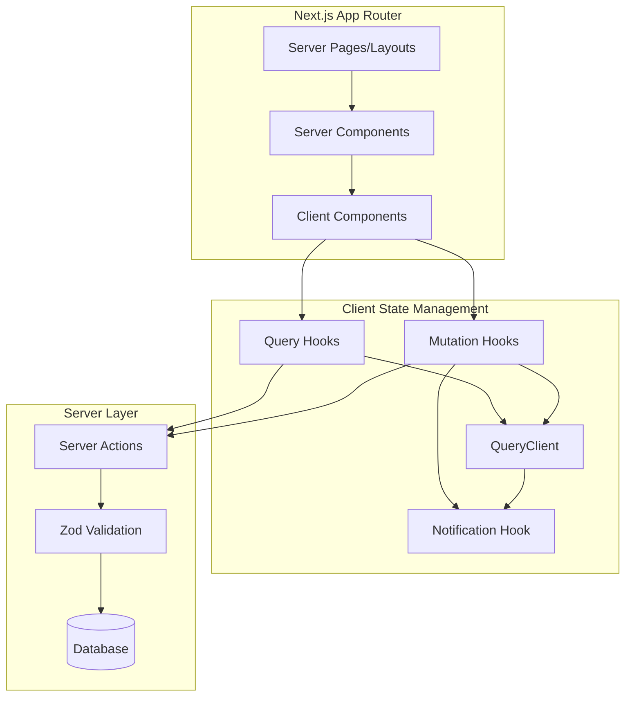

# Design Document

## Overview

Este diseño implementa una arquitectura de datos moderna para Next.js usando TanStack Query, siguiendo patrones de desarrollo senior que optimizan performance, UX y maintainability. La arquitectura sigue el flujo: **Server Pages → Client Components → Query Hooks → Server Actions → Database**.

## Architecture

### High-Level Architecture



### Data Flow Pattern

1. **Server Pages** provide initial data and layout structure
2. **Client Components** consume data through query hooks
3. **Query Hooks** manage server state with TanStack Query
4. **Server Actions** handle mutations with validation
5. **Database** operations are abstracted through Drizzle ORM

## Components and Interfaces

### 1. QueryClient Configuration

```typescript
// lib/query/client.ts
interface QueryClientConfig {
  defaultOptions: {
    queries: {
      staleTime: number;
      cacheTime: number;
      retry: (failureCount: number, error: Error) => boolean;
      refetchOnWindowFocus: boolean;
      refetchOnReconnect: boolean;
    };
    mutations: {
      retry: number;
      onError: (error: Error) => void;
      onSuccess: (data: any) => void;
    };
  };
  queryCache: QueryCache;
  mutationCache: MutationCache;
}
```

### 2. Query Hook Pattern

```typescript
// hooks/queries/use-sections.ts
interface UseSectionsOptions {
  page: string;
  enabled?: boolean;
  initialData?: PageSection[];
}

interface UseSectionsReturn {
  sections: PageSection[];
  isLoading: boolean;
  isError: boolean;
  error: Error | null;
  refetch: () => void;
  isRefetching: boolean;
  isFetching: boolean;
}

export function useSections(options: UseSectionsOptions): UseSectionsReturn;
```

### 3. Mutation Hook Pattern

```typescript
// hooks/mutations/use-section-mutations.ts
interface UseSectionMutationsReturn {
  createSection: UseMutationResult<PageSection, Error, CreateSectionData>;
  updateSection: UseMutationResult<PageSection, Error, UpdateSectionData>;
  deleteSection: UseMutationResult<void, Error, number>;
}

export function useSectionMutations(): UseSectionMutationsReturn;
```

### 4. Notification System

```typescript
// hooks/use-notifications.ts
interface NotificationOptions {
  type: "success" | "error" | "loading" | "info";
  title: string;
  description?: string;
  duration?: number;
  action?: {
    label: string;
    onClick: () => void;
  };
}

interface UseNotificationsReturn {
  notify: (options: NotificationOptions) => string;
  dismiss: (id: string) => void;
  dismissAll: () => void;
  update: (id: string, options: Partial<NotificationOptions>) => void;
}
```

### 5. Server Action Pattern

```typescript
// lib/actions/sections-actions.ts
interface ActionResult<T = any> {
  success: boolean;
  data?: T;
  error?: string;
  fieldErrors?: Record<string, string[]>;
}

export async function createSectionAction(
  data: CreateSectionInput
): Promise<ActionResult<PageSection>>;
```

## Data Models

### Query Keys Structure

```typescript
// lib/query/keys.ts
export const queryKeys = {
  sections: {
    all: ["sections"] as const,
    page: (page: string) => ["sections", "page", page] as const,
    section: (page: string, section: string) =>
      ["sections", "page", page, "section", section] as const,
  },
  contactInfo: {
    all: ["contact-info"] as const,
    type: (type: string) => ["contact-info", "type", type] as const,
  },
  properties: {
    all: ["properties"] as const,
    list: (filters: PropertyFilters) =>
      ["properties", "list", filters] as const,
    detail: (id: number) => ["properties", "detail", id] as const,
  },
} as const;
```

### Cache Invalidation Strategy

```typescript
// lib/query/invalidation.ts
interface InvalidationMap {
  "section.create": string[][];
  "section.update": string[][];
  "section.delete": string[][];
  "contact.create": string[][];
  "contact.update": string[][];
  "contact.delete": string[][];
}

export function getInvalidationKeys(
  action: keyof InvalidationMap,
  context?: any
): string[][];
```

## Error Handling

### Error Boundary Strategy

```typescript
// components/providers/error-boundary.tsx
interface ErrorBoundaryState {
  hasError: boolean;
  error: Error | null;
  errorInfo: ErrorInfo | null;
}

interface ErrorFallbackProps {
  error: Error;
  resetError: () => void;
  retry: () => void;
}
```

### Network Error Recovery

```typescript
// lib/query/error-handling.ts
interface RetryConfig {
  attempts: number;
  delay: (attempt: number) => number;
  shouldRetry: (error: Error) => boolean;
}

export function createRetryConfig(type: "query" | "mutation"): RetryConfig;
```

## Testing Strategy

### Query Hook Testing

```typescript
// __tests__/hooks/use-sections.test.ts
describe("useSections", () => {
  it("should fetch sections for a page", async () => {
    // Test implementation with React Query Testing Library
  });

  it("should handle loading states correctly", async () => {
    // Test loading state management
  });

  it("should handle errors gracefully", async () => {
    // Test error handling
  });
});
```

### Mutation Testing

```typescript
// __tests__/hooks/use-section-mutations.test.ts
describe("useSectionMutations", () => {
  it("should create section and invalidate cache", async () => {
    // Test optimistic updates and cache invalidation
  });

  it("should handle validation errors", async () => {
    // Test server-side validation error handling
  });
});
```

### Integration Testing

```typescript
// __tests__/integration/sections-flow.test.ts
describe("Sections Integration", () => {
  it("should complete full CRUD flow", async () => {
    // Test complete user flow from UI to database
  });
});
```

## Performance Optimizations

### 1. Request Deduplication

- Automatic deduplication of identical queries
- Smart batching of mutations when possible
- Request cancellation for outdated queries

### 2. Cache Optimization

- Intelligent cache invalidation based on data relationships
- Background refetching with stale-while-revalidate
- Selective cache updates for optimistic UI

### 3. Bundle Optimization

- Code splitting for query hooks
- Lazy loading of heavy mutation logic
- Tree shaking of unused query utilities

### 4. SSR/Hydration Optimization

- Prefetching critical queries on server
- Seamless hydration without layout shifts
- Progressive enhancement for non-critical data

## Security Considerations

### 1. Data Validation

- Server-side validation with Zod schemas
- Client-side validation for immediate feedback
- Sanitization of user inputs

### 2. Error Information

- Sanitized error messages for production
- Detailed error logging for development
- No sensitive data exposure in client errors

### 3. Cache Security

- No sensitive data in client-side cache
- Automatic cache clearing on logout
- Secure handling of authentication tokens

## Migration Strategy

### Phase 1: Foundation Setup

1. Install and configure TanStack Query
2. Create base query client and providers
3. Implement notification system
4. Set up error boundaries

### Phase 2: Core Queries Migration

1. Migrate sections queries
2. Migrate contact info queries
3. Update existing components
4. Add loading states and error handling

### Phase 3: Mutations and Advanced Features

1. Implement mutation hooks
2. Add optimistic updates
3. Implement cache invalidation
4. Add offline support

### Phase 4: Performance and Polish

1. Optimize bundle size
2. Add prefetching strategies
3. Implement advanced caching
4. Performance monitoring and optimization

## Monitoring and Observability

### 1. Query Performance Metrics

- Query execution times
- Cache hit/miss ratios
- Error rates by query type
- Network request patterns

### 2. User Experience Metrics

- Loading state durations
- Error recovery success rates
- Offline functionality usage
- User interaction patterns

### 3. Development Metrics

- Bundle size impact
- Build time changes
- Developer productivity metrics
- Code maintainability scores
