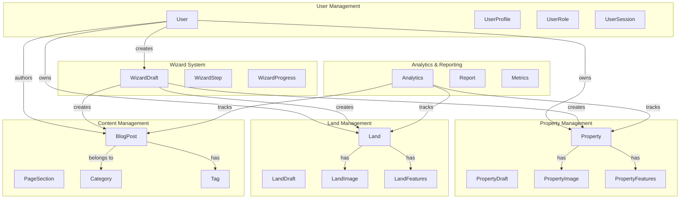

# Domain Model Documentation

## Overview

This document describes the domain model of the Brymar Real Estate platform, including bounded contexts, entities, value objects, and their relationships. The platform follows Domain-Driven Design (DDD) principles to ensure clear separation of business concerns.

## Bounded Context Map



## Bounded Contexts

### 1. User Management Context

**Purpose**: Handles user authentication, authorization, profiles, and user-related operations.

**Core Concepts**:

- User identity and authentication
- Role-based access control
- User profiles and preferences
- Session management

**Key Entities**:

- `User` (Aggregate Root)
- `UserSession`

**Key Value Objects**:

- `UserId`
- `Email`
- `UserProfile`
- `UserRole`
- `UserStatus`
- `UserPreferences`

### 2. Property Management Context

**Purpose**: Manages real estate properties, their lifecycle, and related operations.

**Core Concepts**:

- Property listings and management
- Property media and features
- Property status and lifecycle
- Property search and filtering

**Key Entities**:

- `Property` (Aggregate Root)
- `PropertyDraft`
- `PropertyImage`

**Key Value Objects**:

- `PropertyId`
- `PropertyTitle`
- `Price`
- `Address`
- `PropertyType`
- `PropertyStatus`
- `PropertyFeatures`

### 3. Land Management Context

**Purpose**: Handles land listings, land-specific features, and land management operations.

**Core Concepts**:

- Land listings and specifications
- Land area and zoning information
- Land utilities and features
- Land valuation and pricing

**Key Entities**:

- `Land` (Aggregate Root)
- `LandDraft`
- `LandImage`

**Key Value Objects**:

- `LandId`
- `LandTitle`
- `LandArea`
- `LandType`
- `LandPrice`
- `LandFeatures`

### 4. Content Management Context

**Purpose**: Manages blog posts, pages, and dynamic content for the platform.

**Core Concepts**:

- Blog post creation and publishing
- Content categorization and tagging
- SEO optimization
- Content workflow management

**Key Entities**:

- `BlogPost` (Aggregate Root)
- `PageSection`
- `Category`

**Key Value Objects**:

- `BlogPostId`
- `BlogTitle`
- `BlogContent`
- `BlogCategory`
- `ContentStatus`
- `SEOMetadata`

### 5. Wizard System Context

**Purpose**: Provides a unified wizard system for creating properties, lands, and content.

**Core Concepts**:

- Multi-step form management
- Draft persistence and recovery
- Progress tracking
- Cross-context entity creation

**Key Entities**:

- `WizardDraft` (Aggregate Root)
- `WizardStep`

**Key Value Objects**:

- `WizardDraftId`
- `WizardType`
- `StepProgress`
- `CompletionPercentage`

### 6. Analytics & Reporting Context

**Purpose**: Handles metrics, analytics, and reporting across the platform.

**Core Concepts**:

- User behavior tracking
- Property and land performance metrics
- Content engagement analytics
- Business intelligence reporting

**Key Entities**:

- `Analytics` (Aggregate Root)
- `Report`
- `Metrics`

## Domain Entities

### User (Aggregate Root)

```typescript
class User extends AggregateRoot<UserId> {
  private constructor(
    id: UserId,
    private email: Email,
    private profile: UserProfile,
    private role: UserRole,
    private status: UserStatus,
    private preferences: UserPreferences
  ) {
    super(id);
  }

  // Factory method
  static create(data: CreateUserData): User;

  // Business methods
  updateProfile(profile: UserProfile): void;
  changeRole(role: UserRole): void;
  activate(): void;
  deactivate(): void;
  hasPermission(permission: string): boolean;
  canCreateProperties(): boolean;
  canManageUsers(): boolean;
}
```

**Business Rules**:

- Email must be unique across the system
- Users can only have one active session per device
- Role changes require admin privileges
- Deactivated users cannot perform any actions

**Domain Events**:

- `UserCreatedEvent`
- `UserProfileUpdatedEvent`
- `UserRoleChangedEvent`
- `UserActivatedEvent`
- `UserDeactivatedEvent`

### Property (Aggregate Root)

```typescript
class Property extends AggregateRoot<PropertyId> {
  private constructor(
    id: PropertyId,
    private title: PropertyTitle,
    private description: string,
    private price: Price,
    private address: Address,
    private propertyType: PropertyType,
    private features: PropertyFeatures,
    private images: PropertyImage[],
    private status: PropertyStatus,
    private ownerId: UserId
  ) {
    super(id);
  }

  // Factory method
  static create(data: CreatePropertyData): Property;

  // Business methods
  updatePrice(price: Price): void;
  addImage(image: PropertyImage): void;
  removeImage(imageId: string): void;
  publish(): void;
  markAsSold(): void;
  archive(): void;
  validateForPublication(): ValidationResult;
}
```

**Business Rules**:

- Properties must have at least 3 images to be published
- Price must be positive and within market range
- Published properties cannot be deleted, only archived
- Only property owners or admins can modify properties

**Domain Events**:

- `PropertyCreatedEvent`
- `PropertyUpdatedEvent`
- `PropertyPublishedEvent`
- `PropertySoldEvent`
- `PropertyArchivedEvent`

### Land (Aggregate Root)

```typescript
class Land extends AggregateRoot<LandId> {
  private constructor(
    id: LandId,
    private title: LandTitle,
    private description: string,
    private price: LandPrice,
    private area: LandArea,
    private address: Address,
    private landType: LandType,
    private features: LandFeatures,
    private images: LandImage[],
    private status: LandStatus,
    private ownerId: UserId
  ) {
    super(id);
  }

  // Factory method
  static create(data: CreateLandData): Land;

  // Business methods
  updatePrice(price: LandPrice): void;
  updateArea(area: LandArea): void;
  addUtility(utility: string): void;
  publish(): void;
  markAsSold(): void;
  validateZoning(): boolean;
}
```

**Business Rules**:

- Land area must be positive and within legal limits
- Zoning information must be valid for the location
- Commercial land requires additional documentation
- Land price per square meter must be within market range

### BlogPost (Aggregate Root)

```typescript
class BlogPost extends AggregateRoot<BlogPostId> {
  private constructor(
    id: BlogPostId,
    private title: BlogTitle,
    private content: BlogContent,
    private excerpt: string,
    private category: BlogCategory,
    private tags: Tag[],
    private featuredImage: BlogImage,
    private status: ContentStatus,
    private authorId: UserId,
    private seoMetadata: SEOMetadata
  ) {
    super(id);
  }

  // Factory method
  static create(data: CreateBlogPostData): BlogPost;

  // Business methods
  updateContent(content: BlogContent): void;
  addTag(tag: Tag): void;
  removeTag(tagId: string): void;
  publish(): void;
  archive(): void;
  optimizeForSEO(): void;
}
```

**Business Rules**:

- Blog posts must have a title and content to be published
- SEO metadata is automatically generated if not provided
- Published posts cannot be deleted, only archived
- Authors can only edit their own posts (unless admin)

### WizardDraft (Aggregate Root)

```typescript
class WizardDraft extends AggregateRoot<WizardDraftId> {
  private constructor(
    id: WizardDraftId,
    private wizardType: WizardType,
    private stepData: Map<number, any>,
    private currentStep: number,
    private progress: StepProgress,
    private userId: UserId,
    private completionPercentage: CompletionPercentage
  ) {
    super(id);
  }

  // Factory method
  static create(data: CreateWizardDraftData): WizardDraft;

  // Business methods
  updateStepData(step: number, data: any): void;
  moveToNextStep(): void;
  moveToPreviousStep(): void;
  calculateProgress(): CompletionPercentage;
  canPublish(): boolean;
  publish(): PublishResult;
}
```

**Business Rules**:

- Wizard drafts are automatically saved every 30 seconds
- Users can only have one active draft per wizard type
- Drafts expire after 30 days of inactivity
- All required steps must be completed before publishing

## Value Objects

### Email

```typescript
class Email extends ValueObject<string> {
  private constructor(value: string) {
    super(value);
  }

  static create(email: string): Email {
    // Validation logic
    if (!this.isValidEmail(email)) {
      throw new DomainError("Invalid email format");
    }
    return new Email(email.toLowerCase().trim());
  }

  getDomain(): string {
    return this.value.split("@")[1];
  }

  private static isValidEmail(email: string): boolean {
    const emailRegex = /^[^\s@]+@[^\s@]+\.[^\s@]+$/;
    return emailRegex.test(email);
  }
}
```

### Price

```typescript
class Price extends ValueObject<number> {
  private constructor(value: number) {
    super(value);
  }

  static create(price: number): Price {
    if (price <= 0) {
      throw new DomainError("Price must be positive");
    }

    if (price > 50000000) {
      throw new DomainError("Price exceeds maximum allowed value");
    }

    return new Price(price);
  }

  format(currency: string = "USD"): string {
    return new Intl.NumberFormat("en-US", {
      style: "currency",
      currency: currency,
    }).format(this.value);
  }

  isWithinRange(min: Price, max: Price): boolean {
    return this.value >= min.value && this.value <= max.value;
  }
}
```

### Address

```typescript
class Address extends ValueObject<AddressData> {
  private constructor(value: AddressData) {
    super(value);
  }

  static create(data: AddressData): Address {
    // Validation logic
    if (!data.street || !data.city || !data.country) {
      throw new DomainError("Address must have street, city, and country");
    }

    return new Address({
      street: data.street.trim(),
      city: data.city.trim(),
      state: data.state?.trim(),
      country: data.country.trim(),
      zipCode: data.zipCode?.trim(),
      coordinates: data.coordinates,
    });
  }

  getFullAddress(): string {
    const parts = [
      this.value.street,
      this.value.city,
      this.value.state,
      this.value.country,
      this.value.zipCode,
    ].filter(Boolean);

    return parts.join(", ");
  }

  getCoordinates(): { latitude: number; longitude: number } | null {
    return this.value.coordinates || null;
  }
}
```

### UserRole

```typescript
class UserRole extends ValueObject<string> {
  private static readonly VALID_ROLES = [
    "user",
    "agent",
    "admin",
    "super_admin",
  ];
  private static readonly ROLE_HIERARCHY = {
    user: 1,
    agent: 2,
    admin: 3,
    super_admin: 4,
  };

  private constructor(value: string) {
    super(value);
  }

  static create(role: string): UserRole {
    if (!this.VALID_ROLES.includes(role)) {
      throw new DomainError(`Invalid role: ${role}`);
    }

    return new UserRole(role);
  }

  hasPermission(permission: string): boolean {
    const permissions = this.getPermissions();
    return permissions.includes(permission);
  }

  isHigherThan(otherRole: UserRole): boolean {
    return (
      this.ROLE_HIERARCHY[this.value] > this.ROLE_HIERARCHY[otherRole.value]
    );
  }

  isAdmin(): boolean {
    return this.value === "admin" || this.value === "super_admin";
  }

  isSuperAdmin(): boolean {
    return this.value === "super_admin";
  }

  private getPermissions(): string[] {
    switch (this.value) {
      case "user":
        return ["read_properties", "create_inquiries"];
      case "agent":
        return [
          "read_properties",
          "create_properties",
          "manage_own_properties",
        ];
      case "admin":
        return [
          "read_properties",
          "create_properties",
          "manage_all_properties",
          "manage_users",
        ];
      case "super_admin":
        return ["*"]; // All permissions
      default:
        return [];
    }
  }
}
```

## Domain Services

### PropertyDomainService

```typescript
class PropertyDomainService {
  calculateMarketValue(property: Property, marketData: MarketData): Price {
    const basePrice = property.getPrice();
    const locationMultiplier = marketData.getLocationMultiplier(
      property.getAddress()
    );
    const sizeMultiplier = this.calculateSizeMultiplier(property);
    const featureMultiplier = this.calculateFeatureMultiplier(
      property.getFeatures()
    );

    const marketValue =
      basePrice.value * locationMultiplier * sizeMultiplier * featureMultiplier;
    return Price.create(marketValue);
  }

  validatePropertyForPublication(property: Property): ValidationResult {
    const errors: string[] = [];

    if (property.getImages().length < 3) {
      errors.push("Property must have at least 3 images");
    }

    if (!property.hasCompleteDescription()) {
      errors.push("Property description must be complete");
    }

    if (!this.isValidAddress(property.getAddress())) {
      errors.push("Property address must be valid and verifiable");
    }

    return new ValidationResult(errors.length === 0, errors);
  }

  private calculateSizeMultiplier(property: Property): number {
    // Business logic for size-based pricing
    const features = property.getFeatures();
    const bedrooms = features.getBedrooms();
    const bathrooms = features.getBathrooms();

    return 1 + bedrooms * 0.1 + bathrooms * 0.05;
  }

  private calculateFeatureMultiplier(features: PropertyFeatures): number {
    // Business logic for feature-based pricing
    let multiplier = 1;

    if (features.hasPool()) multiplier += 0.15;
    if (features.hasGarage()) multiplier += 0.1;
    if (features.hasGarden()) multiplier += 0.08;

    return multiplier;
  }

  private isValidAddress(address: Address): boolean {
    // Business logic for address validation
    return address.getCoordinates() !== null;
  }
}
```

### UserDomainService

```typescript
class UserDomainService {
  canUserAccessProperty(user: User, property: Property): boolean {
    // Business logic for property access control
    if (user.getRole().isAdmin()) {
      return true;
    }

    if (property.getOwnerId().equals(user.getId())) {
      return true;
    }

    if (property.getStatus().value === "published") {
      return true;
    }

    return false;
  }

  calculateUserTrustScore(user: User, activities: UserActivity[]): TrustScore {
    // Business logic for trust score calculation
    let score = 50; // Base score

    // Account age bonus
    const accountAge = this.calculateAccountAge(user);
    score += Math.min(accountAge * 2, 20);

    // Activity bonus
    const activityScore = this.calculateActivityScore(activities);
    score += activityScore;

    // Verification bonus
    if (user.isEmailVerified()) score += 10;
    if (user.isPhoneVerified()) score += 10;

    return TrustScore.create(Math.min(score, 100));
  }

  private calculateAccountAge(user: User): number {
    const now = new Date();
    const created = user.getCreatedAt();
    const diffTime = Math.abs(now.getTime() - created.getTime());
    return Math.ceil(diffTime / (1000 * 60 * 60 * 24 * 30)); // months
  }

  private calculateActivityScore(activities: UserActivity[]): number {
    // Business logic for activity scoring
    return Math.min(activities.length * 2, 30);
  }
}
```

## Domain Events

### Property Events

```typescript
class PropertyCreatedEvent extends DomainEvent {
  constructor(
    public readonly propertyId: PropertyId,
    public readonly ownerId: UserId,
    public readonly propertyType: PropertyType
  ) {
    super();
  }
}

class PropertyPublishedEvent extends DomainEvent {
  constructor(
    public readonly propertyId: PropertyId,
    public readonly publishedAt: Date
  ) {
    super();
  }
}

class PropertySoldEvent extends DomainEvent {
  constructor(
    public readonly propertyId: PropertyId,
    public readonly soldPrice: Price,
    public readonly soldAt: Date
  ) {
    super();
  }
}
```

### User Events

```typescript
class UserCreatedEvent extends DomainEvent {
  constructor(
    public readonly userId: UserId,
    public readonly email: Email,
    public readonly role: UserRole
  ) {
    super();
  }
}

class UserRoleChangedEvent extends DomainEvent {
  constructor(
    public readonly userId: UserId,
    public readonly oldRole: UserRole,
    public readonly newRole: UserRole,
    public readonly changedBy: UserId
  ) {
    super();
  }
}
```

## Aggregates and Consistency Boundaries

### Property Aggregate

**Aggregate Root**: Property
**Entities**: PropertyImage
**Value Objects**: PropertyId, PropertyTitle, Price, Address, PropertyType, PropertyStatus, PropertyFeatures

**Consistency Rules**:

- Property images belong to exactly one property
- Property status changes must follow valid transitions
- Property price changes are tracked for audit purposes

### User Aggregate

**Aggregate Root**: User
**Entities**: UserSession (separate aggregate)
**Value Objects**: UserId, Email, UserProfile, UserRole, UserStatus, UserPreferences

**Consistency Rules**:

- User email must be unique across the system
- Role changes must be authorized
- User preferences are always consistent with user profile

### WizardDraft Aggregate

**Aggregate Root**: WizardDraft
**Entities**: WizardStep
**Value Objects**: WizardDraftId, WizardType, StepProgress, CompletionPercentage

**Consistency Rules**:

- Step data must be valid for the wizard type
- Progress calculation must be accurate
- Draft expiration is enforced consistently

## Repository Interfaces

### IPropertyRepository

```typescript
interface IPropertyRepository {
  save(property: Property): Promise<void>;
  findById(id: PropertyId): Promise<Property | null>;
  findByUserId(userId: UserId): Promise<Property[]>;
  search(criteria: PropertySearchCriteria): Promise<Property[]>;
  findByStatus(status: PropertyStatus): Promise<Property[]>;
  delete(id: PropertyId): Promise<void>;
}
```

### IUserRepository

```typescript
interface IUserRepository {
  save(user: User): Promise<void>;
  findById(id: UserId): Promise<User | null>;
  findByEmail(email: Email): Promise<User | null>;
  findByRole(role: UserRole): Promise<User[]>;
  existsByEmail(email: Email): Promise<boolean>;
  delete(id: UserId): Promise<void>;
}
```

### IWizardDraftRepository

```typescript
interface IWizardDraftRepository {
  save(draft: WizardDraft): Promise<void>;
  findById(id: WizardDraftId): Promise<WizardDraft | null>;
  findByUserIdAndType(
    userId: UserId,
    type: WizardType
  ): Promise<WizardDraft | null>;
  findExpiredDrafts(): Promise<WizardDraft[]>;
  delete(id: WizardDraftId): Promise<void>;
}
```

## Business Rules Summary

### Cross-Context Rules

1. **User Authorization**: Users can only access resources they own or have permission to view
2. **Data Consistency**: All entities must maintain referential integrity across contexts
3. **Audit Trail**: All significant business operations must be logged for audit purposes
4. **Data Privacy**: Personal information must be handled according to privacy regulations

### Property Management Rules

1. Properties must have complete information before publication
2. Property prices must be within market range
3. Property images must meet quality standards
4. Property status transitions must follow business workflow

### User Management Rules

1. User emails must be unique and verified
2. Role changes require appropriate authorization
3. User data must be consistent across all contexts
4. Inactive users cannot perform business operations

### Content Management Rules

1. Blog posts must have proper SEO metadata
2. Content must be reviewed before publication
3. Authors can only edit their own content
4. Published content cannot be deleted, only archived

This domain model provides a solid foundation for the Brymar Real Estate platform, ensuring clear business logic separation and maintainable code structure.
